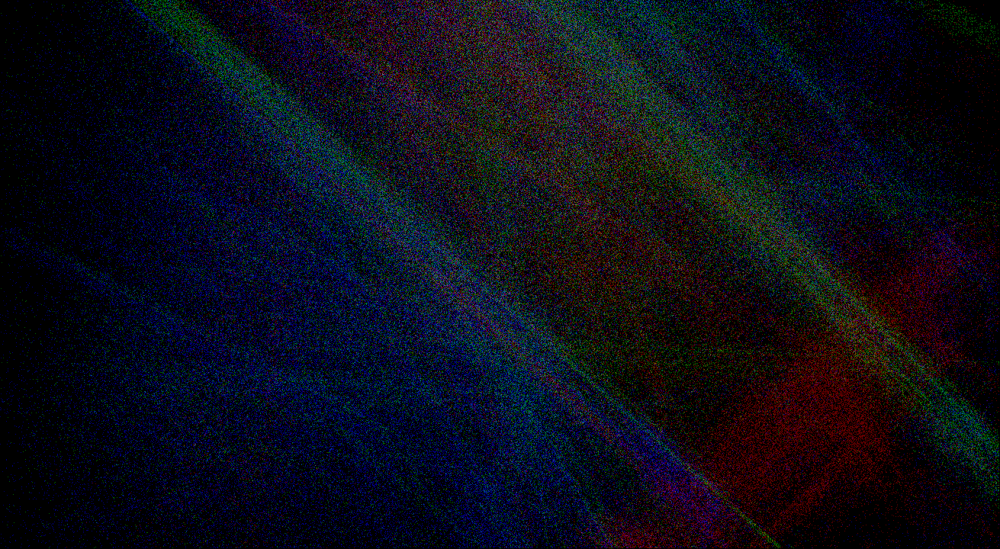

# Kaos IFS (Iterated Function Systems) fractals 

Kaos is a one-of-a-kind screensaver.  It builds an impressionist-like image with pointillism.  Always mesmerizing.  Always enchanting.

Kaos is one of the most fascinating screensavers on the Mac decades ago.  It is created by Reinoud Lamberts in Think Pascal, and bundled into the DarkSide screensaver/fader launcher by Tom Dowdy.  I have had my own recreation for my own recreation -- first in VB, then in C for the XScreenSaver launcher on linux (x86-64 and ARM64).  Now for your enjoyment, this release is a command line app building IFS fractal images in an X11/XQuartz window on linux/MacOS.  Reinoud Lamberts writes: "Of course, Kaos is absolutely free, as long as you are not making money with it."  This is the best complement to the MIT license.

Command line parameters [default value] are:

	microsecond delay when glowing [9000]
	microsecond delay when fading [1000]
	tscale factor at initialization [0.6]

Kaos in DarkSide glows to maximum brightness, then blanks the screen before the next image.  Here the colorful image gracefully fades to black, faster if the second parameter is smaller than the first.  Today's computers can handle graphics with aplomb compared to computers decades past.  The delay parameters help restore the experience for nostalgia.

The third parameter affects appearance, becoming more streaky than starry if lower.  Value may depend on screen resolution, probably best between 0.5 and 0.7 for laptop screens.

To quit, close the X window or hit control-c at the terminal.

This code has been tested with gcc on linux and with clang on MacOS.  

September 22, 2025

*You can revert it to XScreenSaver by uncommenting the vroot.h line
